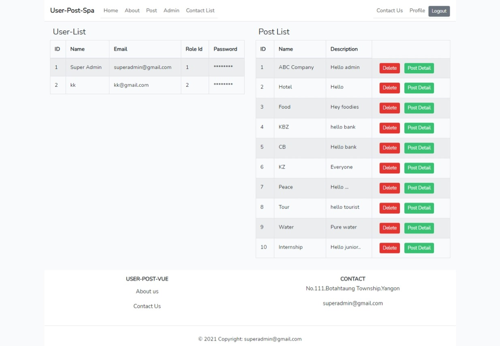
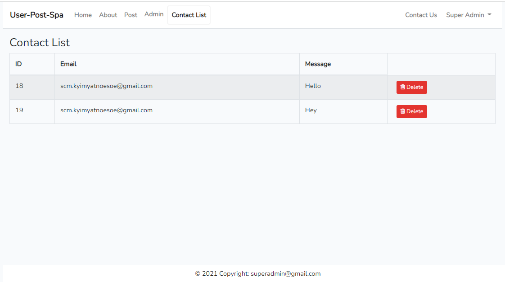
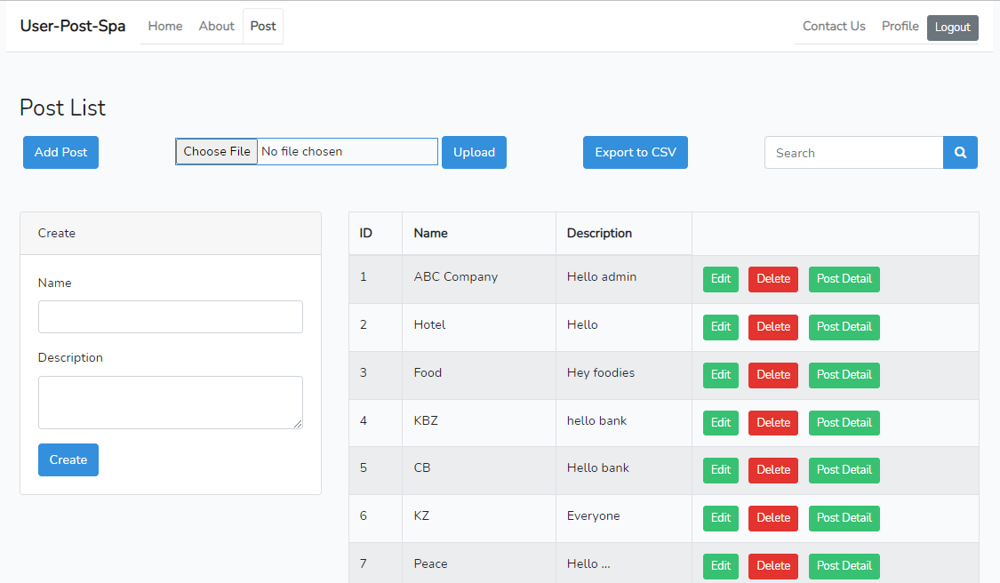
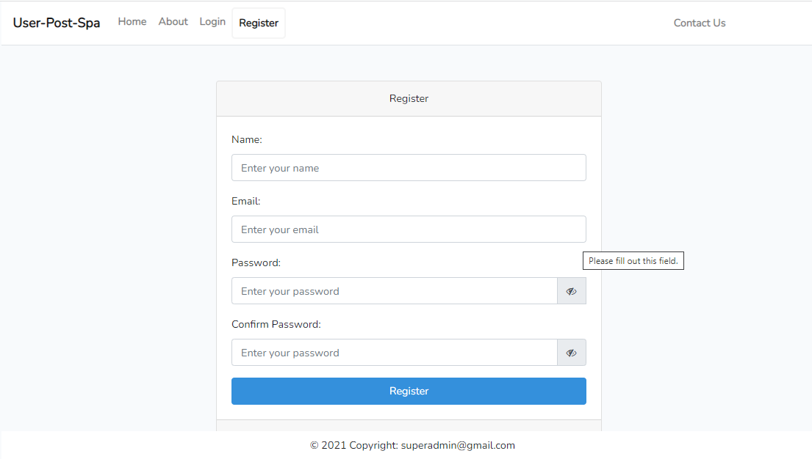
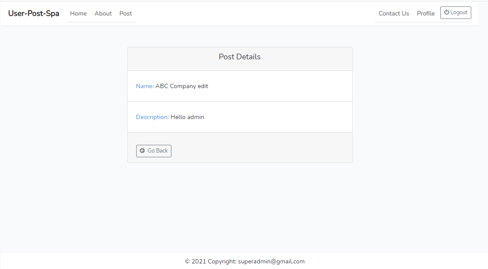

# User-Post-Laravel-Vue-Spa
 A Simple Item Create/Read/Update/Delete (CRUD) Application created using Laravel 8, Vue.js, Axios and bootstrap 4.6 with composer and npm package or dependency management.

Also,I use Vue.js version 2 and Axios for making web requests and handling responses. Vue and Axios are managed by npm, while the rest of the dependencies are managed by composer.

## Demo Link 
https://github.com/KyiMyatNoeSoe7/User-Laravel-Vue-Spa.git

Install all the dependencies using composer
```
composer install
```
Copy the example env file and make the required configuration changes in the .env file
```
cp .env.example .env
```
Generate a new application key
```
php artisan key:generate
```
Run the database migrations (Set the database connection in .env before migrating)
```
php artisan migrate
```
Run the database seeder 
```
php artisan db:seed
```
Install & run npm
```
npm install 
npm run watch
```
Start the local development server
```
php artisan serve
```
You can now access the server at http://localhost:8000 and login using this email and password for admin.

```
Email : superadmin@gmail.com
Password : 12345678
```
## Features

- [User CRUD](#User)
- [Post CRUD](#Post)

## Admin
Admin can manage the users, posts. Admin part include `User Authentication` , `Role and Permission between admin and user`, `send and receive email from users`,`manage contact list`.




## User
User can create, edit, update and delete posts. User part include `create posts`, `edit posts`, `delete posts`, `send contact message to admin`, `search posts`, `export and import posts in csv file`.


    
## Home Page


## Login 


## Register



## About Page


## Profile


## Contact


## Post Details


